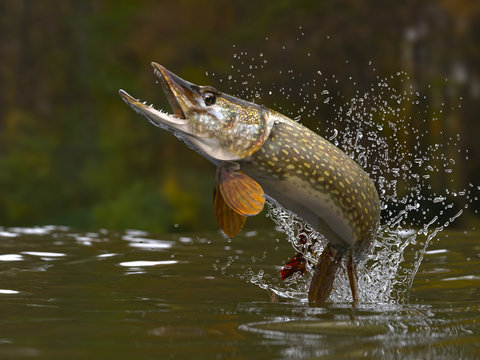
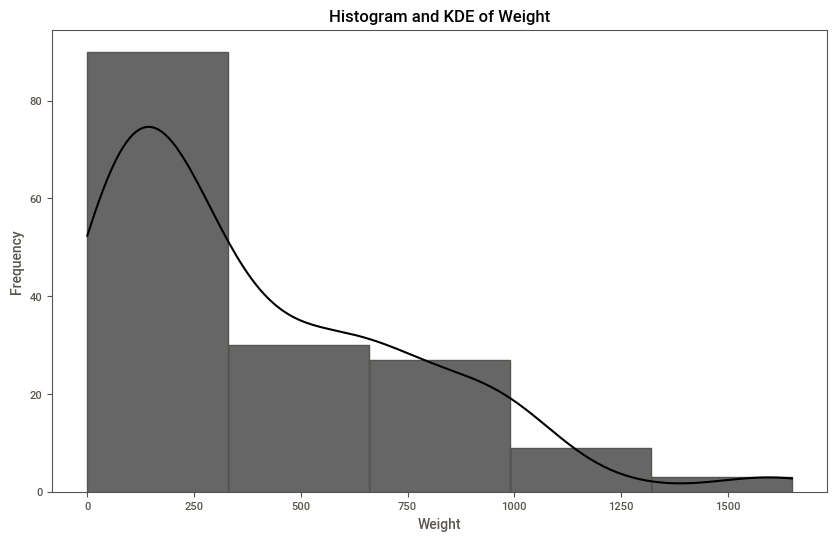

# 🎣 Fish Regression Project 🐟

Welcome to the Fish Regression Project! This project is all about using data to understand and predict fish characteristics.🌊

## 🌟 What This Project Is About

In this project, we're using a special dataset all about fish. Our goal is to use this data to build models that can predict things like fish weight, length, and more.🕵️‍♀️🕵️‍♂️

## 📂 What's Inside

Here's what you'll find in this project:

- **Data**: The fish dataset we'll be working with.
- **Notebooks**: Interactive notebooks where we'll explore and analyze the data.
- **Models**: Our predictive models, built and tested.
- **Results**: The findings from our models and analysis.

## 🛠️ Tools and Technologies

We're using the following tools:

- **Python**: Our main programming language.
- **Jupyter Notebooks**: For interactive data exploration and modeling.
- **Pandas**: For data manipulation and analysis.
- **Scikit-Learn**: For building and evaluating models.

## 🤓 Meet the Data

The fish dataset includes various features like species, weight, length, and more. We'll use these features to predict different characteristics of the fish. 🐠

## 📊 Our Approach

1. **Explore the data**: Understand what each feature means and how they relate to each other.

2. **Preprocess the data**: Clean and prepare the data for modeling.
3. **Build models**: Create different models to predict fish characteristics.
4. **Hyperparameter tuning**: Optimize our models to achieve the best performance.

5. **Evaluate and improve**: Test our models and make them better.

### Linear Regression Model Results

**Training Data:**
- Significant average deviation of predictions from actual values.
- Explains 91% of the variance in the data.

**Test Data:**
- Good generalization with lower deviation.
- Explains 94% of the variance in the data.

### Best Extra Trees Model Results

**Training Data:**
- Extremely close fit with very low deviation.
- Nearly all variance explained, indicating overfitting.

**Test Data:**
- The Extra Trees model outperforms the Linear Regression model in both RMSE and R².

**Summary**
- **Extra Trees Model**: Better prediction accuracy and variance explanation, but potential overfitting needs to be addressed.
- **Linear Regression Model**: Good generalization with stable performance, but higher errors compared to the Extra Trees model.

